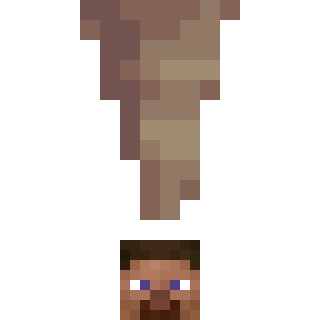

# It seems loosely connected to the ceiling

Pointed Dripstone will now fall from the sky and hit everyone on the head.

Source of inspiration: **[Casualties: Unknown](https://orsonik.itch.io/scav-prototype)**.

_ps: `It seems loosely connected to the ceiling` is the original text in the game._

## Mod configs
* `detectionVerticalRange`: Detection Vertical Range
* `maxDamage`: Max Damage
* `damageMultiplier`: Damage Multiplier

# 与洞顶的连接似乎并不牢固
滴水石锥将会从天上掉下来打在所有生物的头上。

灵感来源：**[Casualties: Unknown](https://orsonik.itch.io/scav-prototype)**。

_ps：`与洞顶的连接似乎并不牢固`就是游戏中的原文。_

## 模组配置
* `detectionVerticalRange`：检测垂直范围
* `maxDamage`：最大伤害
* `damageMultiplier`：伤害倍数